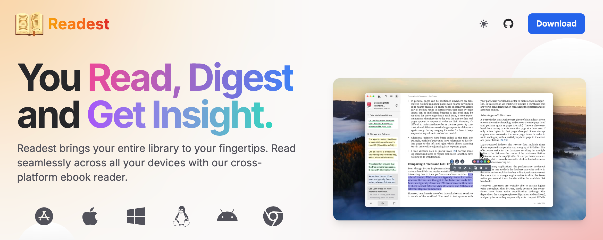
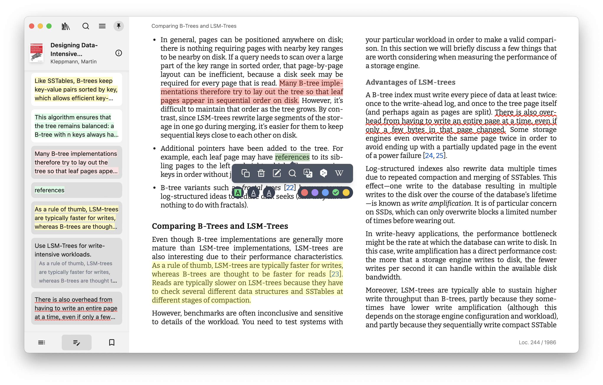
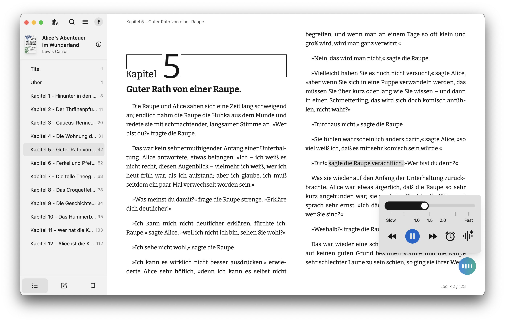
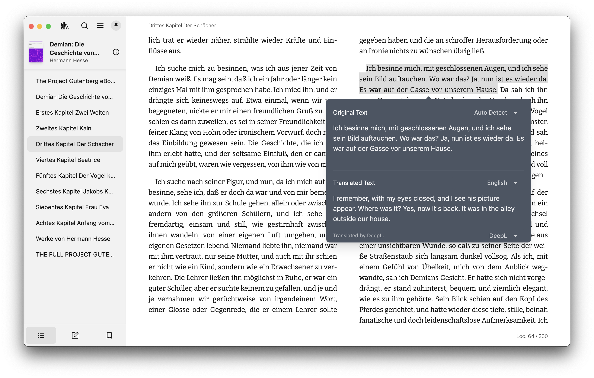
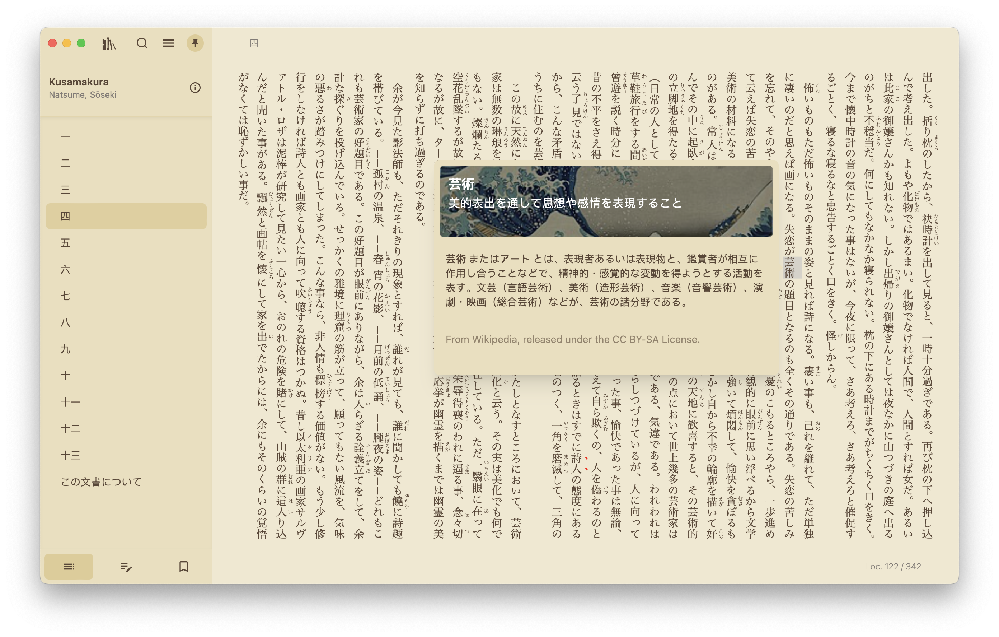
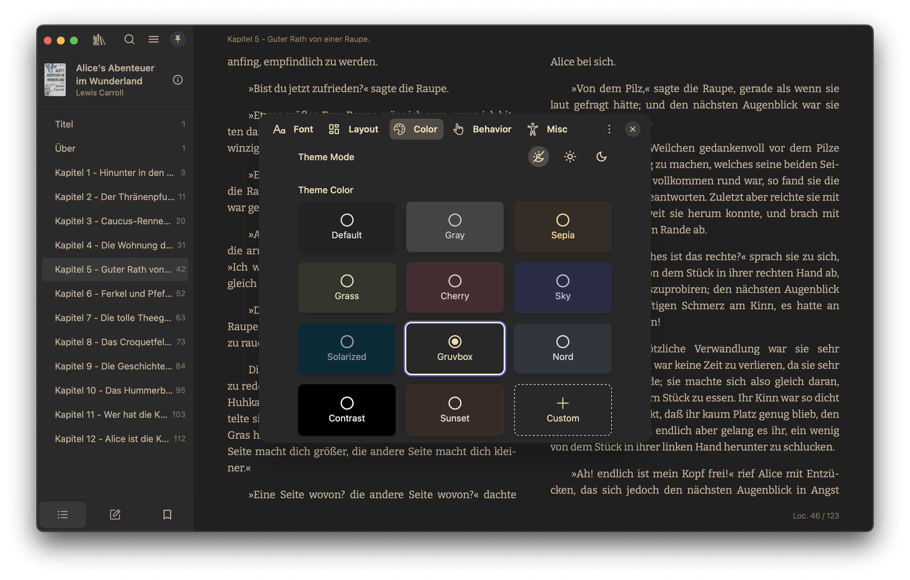

<div align="center">
  <a href="https://risale-ai-studio.com?utm_source=github&utm_medium=referral&utm_campaign=readme" target="_blank">
    
  </a>
  <h1>Risale AI Studio</h1>
  <br>

[Risale AI Studio][link-website] is the world's premier digital library for the Risale-i Nur collection — a cross-platform ebook reader designed for immersive and deep reading experiences. Built as a modern rewrite of [Foliate](https://github.com/johnfactotum/foliate), it leverages [Next.js 16](https://github.com/vercel/next.js) and [Tauri v2](https://github.com/tauri-apps/tauri) to deliver a smooth, cross-platform experience across macOS, Windows, Linux, Android, iOS, and the Web. Features professional Turkish/Ottoman/Arabic/Russian typography, built-in Ottoman-Turkish dictionary, AI-powered study tools, and smart annotations.

[![Website][badge-website]][link-website]
[![Web App][badge-web-app]][link-vercel]
[![OS][badge-platforms]][link-website]
<br>
[![Discord][badge-discord]][link-discord]
[![Reddit][badge-reddit]][link-reddit]
[![AGPL Licence][badge-license]](LICENSE)
[![Language Coverage][badge-language-coverage]][link-locales]
[![Donate][badge-donate]][link-donate]
[![Latest release][badge-release]][link-gh-releases]
[![Last commit][badge-last-commit]][link-gh-commits]
[![Commits][badge-commit-activity]][link-gh-pulse]
[![][badge-hellogithub]][link-hellogithub]
[![Ask DeepWiki][badge-deepwiki]][link-deepwiki]

</div>

<p align="center">
  <a href="#features">Features</a> •
  <a href="#planned-features">Planned Features</a> •
  <a href="#screenshots">Screenshots</a> •
  <a href="#downloads">Downloads</a> •
  <a href="#getting-started">Getting Started</a> •
  <a href="#troubleshooting">Troubleshooting</a> •
  <a href="#support">Support</a> •
  <a href="#license">License</a>
</p>

<div align="center">
  <a href="https://risale-ai-studio.com" target="_blank">
    
  </a>
</div>

## Features

<div align="left">✅ Implemented</div>

| **Feature**                                | **Description**                                                                                                        | **Status** |
| ------------------------------------------ | ---------------------------------------------------------------------------------------------------------------------- | ---------- |
| **Multi-Format Support**                   | Support EPUB, MOBI, KF8 (AZW3), FB2, CBZ, TXT, PDF                                                                     | ✅         |
| **Scroll/Page View Modes**                 | Switch between scrolling or paginated reading modes.                                                                   | ✅         |
| **Full-Text Search**                       | Search across the entire book to find relevant sections.                                                               | ✅         |
| **Annotations and Highlighting**           | Add highlights, bookmarks, and notes to enhance your reading experience and use instant mode for quicker interactions. | ✅         |
| **Dictionary/Wikipedia Lookup**            | Instantly look up words and terms when reading.                                                                        | ✅         |
| **[Parallel Read][link-parallel-read]**    | Read two books or documents simultaneously in a split-screen view.                                                     | ✅         |
| **Customize Font and Layout**              | Adjust font, layout, theme mode, and theme colors for a personalized experience.                                       | ✅         |
| **Code Syntax Highlighting**               | Read software manuals with rich coloring of code examples.                                                             | ✅         |
| **File Association and Open With**         | Quickly open files in Risale AI Studio in your file browser with one-click.                                                     | ✅         |
| **Library Management**                     | Organize, sort, and manage your entire ebook library.                                                                  | ✅         |
| **OPDS/Calibre Integration**               | Integrate OPDS/Calibre to access online libraries and catalogs.                                                        | ✅         |
| **Translate with DeepL and Yandex**        | From a single sentence to the entire book—translate instantly.                                                         | ✅         |
| **Text-to-Speech (TTS) Support**           | Enjoy smooth, multilingual narration—even within a single book.                                                        | ✅         |
| **Sync across Platforms**                  | Synchronize book files, reading progress, notes, and bookmarks across all supported platforms.                         | ✅         |
| [**Sync with Koreader**][link-kosync-wiki] | Synchronize reading progress, notes, and bookmarks with [Koreader][link-koreader] devices.                             | ✅         |
| **Accessibility**                          | Provides full keyboard navigation and supports for screen readers such as VoiceOver, TalkBack, NVDA, and Orca.         | ✅         |
| **Visual & Focus Aids**                    | Reading ruler, paragraph-by-paragraph reading mode, and speed reading features.                                        | ✅         |

## Risale-i Nur Features

| **Feature**                            | **Description**                                                                                     | **Status** |
| -------------------------------------- | --------------------------------------------------------------------------------------------------- | ---------- |
| **Built-in Risale Books (27 EPUBs)**   | 16 Turkish + 11 Russian parallel translations — auto-imported on first launch                       | ✅         |
| **Russian Translations (11 EPUBs)**    | Parallel Russian EPUBs for side-by-side reading — generated from risale_extraction corpus           | ✅         |
| **Külliyat Search**                    | Full-text search across all 15 Risale books simultaneously using Orama FTS                          | ✅         |
| **Risale Lugat (Ottoman Dictionary)**  | 38,963 terms with FTS5/LIKE search, 78.5% frequency coverage, 70+ suffix stemming                  | ✅         |
| **Lugat In-Text Highlighting**         | Green dotted underline + click popup for 4,724 frequent dictionary terms directly in book text      | ✅         |
| **Quran Meal (10 languages)**          | Click any Arabic verse → instant translation in TR/EN/RU/BN/ES/FR/ID/SV/UR/ZH with surah:ayah ref  | ✅         |
| **Meal AI Fallback**                   | If verse not in database → AI semantic translation + term breakdown (3-tier: DB→Lugat→AI)           | ✅         |
| **AI Dictionary (Context-Aware)**      | DeepSeek/Gemini-powered definitions IN CONTEXT of the paragraph, with Quran/Hadith/Risale refs      | ✅         |
| **AI Passage Analysis**                | Select a sentence or paragraph → AI extracts all complex terms, translates, explains context        | ✅         |
| **AI Assistant with RAG**              | Ask questions about the Risale with context-aware AI (Reedy RAG — BookIndexer + hybrid FTS/vector)  | ✅         |
| **Külliyat Deep Dive (Reedy)**         | AI agent searches across ALL indexed Risale books for thematic analysis                             | ✅         |
| **Save AI Responses to Notes**         | One-click save AI definitions and Reedy responses as formatted book notes                           | ✅         |
| **Hover Dictionary Tooltip**           | Hover any word → instant Lugat definition popup (desktop)                                           | ✅         |
| **Dictionary Language Selector**       | Switch definition language on-the-fly: 🇷🇺 Русский / 🇹🇷 Türkçe / 🇬🇧 English / 🇸🇦 العربية              | ✅         |
| **Anlam Açık Modu**                    | Inline word definitions from the dictionary with green dashed underline + tooltip                   | ✅         |
| **Haşiye (Verse Commentary)**          | Arabic verse popups with meal index — block-level + inline dotted underline, golden hover effect    | ✅         |
| **Professional Typography**            | ITC Souvenir, Minion Pro, Nassim Arabic Pro, Kazimir Text — per-script font system, 53 fonts on R2 | ✅         |
| **Parallel Translation Sync**          | Side-by-side reading of original + translation with shared scroll position                          | 🛠         |
| **Quote Widget (Vecize)**              | 150 daily wisdom quotes from all Risale books                                                       | ✅         |
| **Annotation Layers**                  | Multiple annotation layers: personal notes, haşiye, lugat, author notes — toggleable in reader      | ✅         |
| **Mobile AI Access**                   | Dedicated 🤖 AI and 📓 Notebook buttons in mobile reader toolbar                                    | ✅         |

## Planned Features

<div align="left">🛠 Building</div>
<div align="left">🔄 Planned</div>

| **Feature**                     | **Description**                                                            | **Priority** |
| ------------------------------- | -------------------------------------------------------------------------- | ------------ |
| **Parallel Translation UI**     | Wire up parallelViewStore + useParallelSync to reader (11 RU EPUBs ready)  | 🛠           |
| **SorularlaRisale RAG**         | Scrape Q&A from sorularlarisale.com → load into Reedy RAG (1000+ answers)  | 🛠           |
| **Meal Matching Improvement**   | Smarter Arabic scoring — better normalization, fewer wrong matches          | 🛠           |
| **AI-Powered Summarization**    | Generate summaries of books or chapters using AI for quick insights.       | 🛠           |
| **Advanced Reading Stats**      | Track reading time, pages read, and more for detailed insights.            | 🔄           |
| **Audiobook Support**           | Extend functionality to play and manage audiobooks.                        | 🔄           |
| **Handwriting Annotations**     | Add support for handwriting annotations using a pen on compatible devices. | 🔄           |
| **In-Library Full-Text Search** | Search across your entire ebook library to find topics and quotes.         | 🔄           |
| **EPUB Tools GUI**              | Visual editor for EPUB annotations, validator, CI/CD pipeline               | 🔄           |
| **Mobile Apps (Store)**         | Google Play + App Store publication via Tauri                               | 🔄           |
| **KOReader Sync**               | Bidirectional sync of annotations/progress with KOReader e-ink devices      | 🔄           |
| **Community Features**          | Shared annotation layers, group reading, 120-day program, quizzes           | 🔄           |

Stay tuned for continuous improvements and updates! Contributions and suggestions are always welcome—let's build the ultimate reading experience together. 😊

## Screenshots












---

## Downloads

### Mobile Apps

<div align="center">
  <a href="https://apps.apple.com/app/id6738622779">
    </a>&nbsp;&nbsp;&nbsp;&nbsp;
  <a href="https://play.google.com/store/apps/details?id=com.liskinlabs.risale-ai-studio">
    </a>
</div>

### Platform-Specific Downloads

- macOS / iOS / iPadOS : Search and install **Risale AI Studio** on the [App Store][link-appstore], _also_ available on TestFlight for beta test (send your Apple ID to <readestapp@gmail.com> to request access).
- Windows / Linux / Android: Visit and download **Risale AI Studio** at [https://risale-ai-studio.com][link-website] or the [Releases on GitHub][link-gh-releases].
- Linux users can also install [Risale AI Studio on Flathub][link-flathub].
- Web: Visit and use **Risale AI Studio for Web** at [https://risale-ai-studio.vercel.app][link-vercel].

## Requirements

- **Node.js** and **pnpm** for Next.js development
- **Rust** and **Cargo** for Tauri development

For the best experience to build Risale AI Studio for yourself, use a recent version of Node.js and Rust. Refer to the [Tauri documentation](https://v2.tauri.app/start/prerequisites/) for details on setting up the development environment prerequisites on different platforms.

```bash
nvm install v24
nvm use v24
npm install -g pnpm
rustup update
```

## Getting Started

To get started with Risale AI Studio, follow these steps to clone and build the project.

### 1. Clone the Repository

```bash
git clone https://github.com/LiskinLabs/risale-ai-studio.git
cd risale-ai-studio
```

### 2. Install Dependencies

```bash
# might need to rerun this when code is updated
git submodule update --init --recursive
pnpm install
# copy vendors dist libs to public directory
pnpm --filter @LiskinLabs/risale-ai-studio-app setup-vendors
```

### 3. Verify Dependencies Installation

To confirm that all dependencies are correctly installed, run the following command:

```bash
pnpm tauri info
```

This command will display information about the installed Tauri dependencies and configuration on your platform. Note that the output may vary depending on the operating system and environment setup. Please review the output specific to your platform for any potential issues.

For Windows targets, “Build Tools for Visual Studio 2022” (or a higher edition of Visual Studio) and the “Desktop development with C++” workflow must be installed. For Windows ARM64 targets, the “VS 2022 C++ ARM64 build tools” and "C++ Clang Compiler for Windows" components must be installed. And make sure `clang` can be found in the path by adding `C:\Program Files (x86)\Microsoft Visual Studio\2022\BuildTools\VC\Tools\Llvm\x64\bin` for example in the environment variable `Path`.

### 4. Build for Development

```bash
# Start development for the Tauri app
pnpm tauri dev
# or start development for the Web app
pnpm dev-web
# preview with OpenNext build for the Web app
pnpm preview
```

For Android:

```bash
# Initialize the Android environment (run once)
rm apps/readest-app/src-tauri/gen/android
pnpm tauri android init
pnpm tauri icon ../../data/icons/readest-book.png
git checkout apps/readest-app/src-tauri/gen/android

pnpm tauri android dev
# or if you want to dev on a real device
pnpm tauri android dev --host
```

For iOS:

```bash
# Set up the iOS environment (run once)
pnpm tauri ios init
pnpm tauri icon ../../data/icons/readest-book.png

pnpm tauri ios dev
# or if you want to dev on a real device
pnpm tauri ios dev --host
```

### 5. Build for Production

```bash
pnpm tauri build
pnpm tauri android build
pnpm tauri ios build
```

Please refer to our release script if you experience any issues:
https://github.com/LiskinLabs/risale-ai-studio/blob/main/.github/workflows/release.yml

### 6. Setup dev environment with Nix

If you have Nix installed, you can leverage flake to enter a development shell
with all the necessary dependencies:

```bash
nix develop ./ops  # enter a dev shell for the web app
nix develop ./ops#ios # enter a dev shell for the ios app
nix develop ./ops#android # enter a dev shell for the android app
```

### 7. More information

Please check the [wiki][link-gh-wiki] of this project for more information on development.

## Troubleshooting

### 1. Risale AI Studio Won’t Launch on Windows (Missing Edge WebView2 Runtime)

**Symptom**

- When you double-click readest.exe, nothing happens. No window appears, and Task Manager does not show the process.
- This can affect both the standard installer and the portable version.

**Cause**

- Microsoft Edge WebView2 Runtime is either missing, outdated, or improperly installed on your system. Risale AI Studio depends on WebView2 to render the interface on Windows.

**How to Fix**

1. Check if WebView2 is installed
   - Open “Add or Remove Programs” (a.k.a. Apps & features) on Windows. Look for “Microsoft Edge WebView2 Runtime.”
2. Install or Update WebView2
   - Download the WebView2 Runtime directly from Microsoft: [link](https://developer.microsoft.com/en-us/microsoft-edge/webview2?form=MA13LH).
   - If you prefer an offline installer, download the offline package and run it as an Administrator.
3. Re-run Risale AI Studio
   - After installing/updating WebView2, launch readest.exe again.
   - If you still encounter problems, reboot your PC and try again.

**Additional Tips**

- If reinstalling once doesn’t work, uninstall Edge WebView2 completely, then reinstall it with Administrator privileges.
- Verify your Windows installation has the latest updates from Microsoft.

**Still Stuck?**

- See Issue [LiskinLabs/risale-ai-studio#358](https://github.com/LiskinLabs/risale-ai-studio/issues/358) for further details, or head over to our [Discord][link-discord] server and open a support discussion with detailed logs of your environment and the steps you’ve taken.

### 2. AppImage Launches but Only Shows a Taskbar Icon

On some Arch Linux systems—especially those using Wayland—the Risale AI Studio AppImage may briefly show an icon in the taskbar and then exit without opening a window.

You might see logs such as:

```
Could not create default EGL display: EGL_BAD_PARAMETER. Aborting...
```

This behavior is usually caused by compatibility issues between the bundled AppImage libraries and the system’s EGL / Wayland environment.

**Workaround 1: Launch with LD_PRELOAD (recommended)**

You can preload the system Wayland client library before launching the AppImage:

```
LD_PRELOAD=/usr/lib/libwayland-client.so /path/to/Risale AI Studio.AppImage
```

This workaround has been confirmed to resolve the issue on affected systems.

**Workaround 2: Use the Flatpak Version**

If you prefer a more reliable out-of-the-box experience on Arch Linux, consider using the [Flatpak build on Flathub][link-flathub] instead. The Flatpak runtime helps avoid system library mismatches and tends to behave more consistently across different Wayland and X11 setups.

## Contributors

Risale AI Studio is open-source, and contributions are welcome! Feel free to open issues, suggest features, or submit pull requests. Please **review our [contributing guidelines](CONTRIBUTING.md) before you start**. We also welcome you to join our [Discord][link-discord] community for either support or contributing guidance.

<a href="https://github.com/LiskinLabs/risale-ai-studio/graphs/contributors">
  <p align="left">
    
  </p>
</a>

## Support

If Risale AI Studio has been useful to you, consider supporting its development. You can [become a sponsor on GitHub](https://github.com/sponsors/readest), [donate via Stripe](https://donate.stripe.com/4gMcN5aZdcE52kW3TFgjC01), or [donate with crypto](https://donate.risale-ai-studio.com). Your contribution helps us squash bugs faster, improve performance, and keep building great features.

### Sponsors

<p align="center">
  <a title="Browser testing via TestMu AI" href="https://www.testmuai.com/?utm_medium=sponsor&utm_source=readest" target="_blank">
    
  </a>
</p>

## License

Risale AI Studio is free software: you can redistribute it and/or modify it under the terms of the [GNU Affero General Public License](https://www.gnu.org/licenses/agpl-3.0.html) as published by the Free Software Foundation, either version 3 of the License, or (at your option) any later version. See the [LICENSE](LICENSE) file for details.

The following libraries and frameworks are used in this software:

- [foliate-js](https://github.com/johnfactotum/foliate-js), which is MIT licensed.
- [zip.js](https://github.com/gildas-lormeau/zip.js), which is licensed under the BSD-3-Clause license.
- [fflate](https://github.com/101arrowz/fflate), which is MIT licensed.
- [PDF.js](https://github.com/mozilla/pdf.js), which is licensed under Apache License 2.0.
- [daisyUI](https://github.com/saadeghi/daisyui), which is MIT licensed.
- [marked](https://github.com/markedjs/marked), which is MIT licensed.
- [next.js](https://github.com/vercel/next.js), which is MIT licensed.
- [react-icons](https://github.com/react-icons/react-icons), which has various open-source licenses.
- [react](https://github.com/facebook/react), which is MIT licensed.
- [tauri](https://github.com/tauri-apps/tauri), which is MIT licensed.

The following fonts are utilized in this software, either bundled within the application or provided through web fonts:

[Bitter](https://fonts.google.com/specimen/Bitter), [Fira Code](https://fonts.google.com/specimen/Fira+Code), [Inter](https://fonts.google.com/specimen/Inter), [Literata](https://fonts.google.com/specimen/Literata), [Merriweather](https://fonts.google.com/specimen/Merriweather), [Noto Sans](https://fonts.google.com/specimen/Noto+Sans), [Roboto](https://fonts.google.com/specimen/Roboto), [LXGW WenKai](https://github.com/lxgw/LxgwWenKai), [MiSans](https://hyperos.mi.com/font/en/), [Source Han](https://github.com/adobe-fonts/source-han-sans/), [WenQuanYi Micro Hei](http://wenq.org/wqy2/)

We would also like to thank the [Web Chinese Fonts Plan](https://chinese-font.netlify.app) for offering open-source tools that enable the use of Chinese fonts on the web.

---

<div align="center" style="color: gray;">Happy reading with Risale AI Studio!</div>

[badge-website]: https://img.shields.io/badge/website-risale-ai-studio.com-orange
[badge-web-app]: https://img.shields.io/badge/read%20online-risale--ai--studio.vercel.app-orange
[badge-license]: https://img.shields.io/github/license/readest/readest?color=teal
[badge-release]: https://img.shields.io/github/release/readest/readest?color=green
[badge-platforms]: https://img.shields.io/badge/platforms-macOS%2C%20Windows%2C%20Linux%2C%20Android%2C%20iOS%2C%20Web%2C%20PWA-green
[badge-last-commit]: https://img.shields.io/github/last-commit/readest/readest?color=blue
[badge-commit-activity]: https://img.shields.io/github/commit-activity/m/readest/readest?color=blue
[badge-discord]: https://img.shields.io/discord/1314226120886976544?color=5865F2&label=discord&labelColor=black&logo=discord&logoColor=white&style=flat-square
[badge-hellogithub]: https://abroad.hellogithub.com/v1/widgets/recommend.svg?rid=8a5b6ade2aee461a8bd94e59200682a7&claim_uid=eRLUbPOy2qZtDgw&theme=small
[badge-donate]: https://donate.risale-ai-studio.com/badge.svg
[badge-deepwiki]: https://deepwiki.com/badge.svg
[badge-reddit]: https://img.shields.io/reddit/subreddit-subscribers/readest?style=flat&logo=reddit&color=F37E41
[badge-language-coverage]: https://img.shields.io/badge/coverage-53%25%20population%20🌍-green
[link-donate]: https://donate.risale-ai-studio.com/?tickers=btc%2Ceth%2Csol%2Cusdc
[link-appstore]: https://apps.apple.com/app/apple-store/id6738622779?pt=127463130&ct=github&mt=8
[link-website]: https://risale-ai-studio.com?utm_source=github&utm_medium=referral&utm_campaign=readme
[link-flathub]: https://flathub.org/en/apps/com.liskinlabs.risale-ai-studio
[link-web-readest]: https://web.risale-ai-studio.com
[link-vercel]: https://risale-ai-studio.vercel.app
[link-gh-releases]: https://github.com/LiskinLabs/risale-ai-studio/releases
[link-gh-commits]: https://github.com/LiskinLabs/risale-ai-studio/commits/main
[link-gh-pulse]: https://github.com/LiskinLabs/risale-ai-studio/pulse
[link-gh-wiki]: https://github.com/LiskinLabs/risale-ai-studio/wiki
[link-discord]: https://discord.gg/gntyVNk3BJ
[link-parallel-read]: https://risale-ai-studio.com/#parallel-read
[link-koreader]: https://github.com/koreader/koreader
[link-hellogithub]: https://hellogithub.com/repository/8a5b6ade2aee461a8bd94e59200682a7
[link-deepwiki]: https://deepwiki.com/readest/readest
[link-locales]: https://github.com/LiskinLabs/risale-ai-studio/tree/main/apps/readest-app/public/locales
[link-kosync-wiki]: https://github.com/LiskinLabs/risale-ai-studio/wiki/Sync-with-Koreader-devices
[link-reddit]: https://reddit.com/r/readest/
